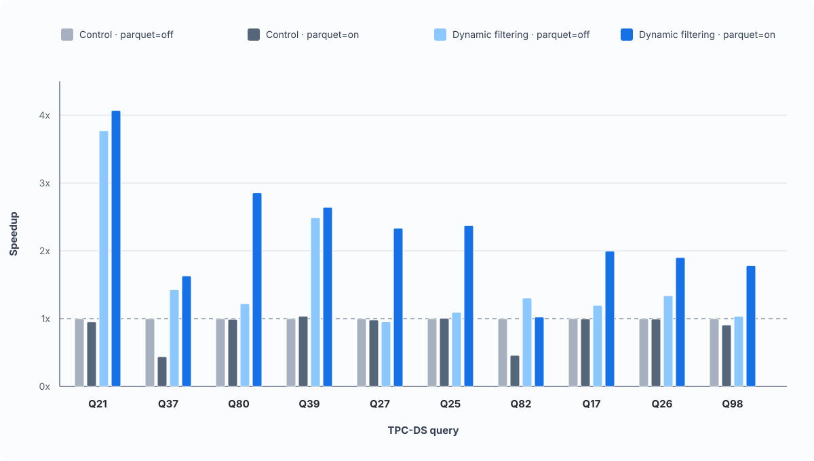
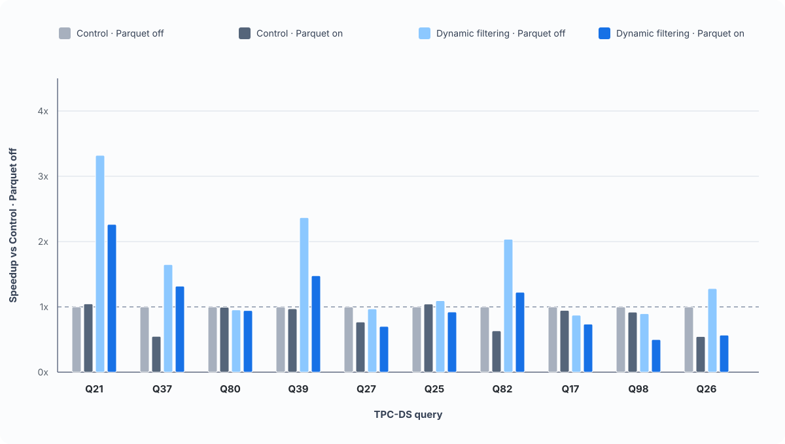

<!-- _class: lead -->

# Optimizing<br>Distributed Queries<br>with Dynamic Filtering

<div class="title-rule"></div>

Jayant Shrivastava

<!--
Dynamic filtering is already a powerful single-process optimization in DataFusion.
This talk is about what changes when the producer of a filter and the scan that can
use it no longer share memory—or even a machine.
-->

---

# The Motivating Query

<div class="columns wide-left">
<div>

```sql
SELECT f.*
FROM fact AS f
JOIN (
  SELECT d_key
  FROM dim
  WHERE region = 'EMEA'
) AS d
ON f.d_key = d.d_key;
```

</div>
<div>

The small `dim` input becomes the **build side**.

The large `fact` input becomes the **probe side**.

Only a small subset of probe keys can match.

</div>
</div>

<!--
Start with the familiar hash-join shape. We read the small input first and build
a hash table. The question is how much of the large fact table we need to process
before discovering that most rows cannot match.
-->

---

# Rejecting Rows Late Is Expensive

<div class="pipeline">
  <span>Read +<br/>decode</span><b>→</b>
  <span>Materialize<br/>buffers</span><b>→</b>
  <span>Evaluate<br/>expressions</span><b>→</b>
  <span>Shuffle<br/>over network</span><b>→</b>
  <span>Hash join<br/>columns</span><b>→</b>
  <span class="reject">Reject<br/>row</span>
</div>

In a distributed query, non-matching rows can also consume:

- serialization and network bandwidth
- shuffle capacity
- CPU and memory on downstream operators

<div class="callout">The cheapest row is the one the data source never emits.</div>

<!--
Dynamic filtering is not only about reducing the final join input. Applying a
predicate at the scan avoids every operation between the source and the join.
The network makes that avoided work even more valuable in a distributed plan.
-->

---

<!-- _class: figure -->

# Colocated Dynamic Filtering



<div class="caption">The Hash Join and probe-side Data Source share Worker B, so an atomic memory update can reject rows early.</div>

<!--
Worker A sends build rows to Worker B. After learning the build-side keys, the
Hash Join updates a dynamic expression shared with the probe-side Data Source on
Worker B. This fast path requires no coordinator because producer and consumer
are colocated.
-->

---

<!-- _class: figure -->

# Remote Dynamic Filtering



<div class="caption">Remote tasks do not share memory—even when they belong to the same query.</div>

<!--
The optimization does not automatically become distributed. The join can update
its local expression, but a scan on another worker owns a different process and
cannot observe that memory. We need to turn an implicit memory relationship into
explicit query dataflow.
-->

---

# Turn Shared State into Explicit Dataflow

<div class="cards">
  <div class="card">
    <div class="number">1</div>
    <h3>Discover</h3>
    <p>Find producers and consumers while the complete distributed plan is available.</p>
  </div>
  <div class="card">
    <div class="number">2</div>
    <h3>Collect + merge</h3>
    <p>Receive task-local predicates and combine them according to operator semantics.</p>
  </div>
  <div class="card">
    <div class="number">3</div>
    <h3>Broadcast + apply</h3>
    <p>Route one safe predicate to every worker containing a matching consumer.</p>
  </div>
</div>

<div class="callout">The coordinator transports expressions; DataFusion's existing scan-pushdown path applies them.</div>

<!--
The coordinator is not inventing a new filtering engine. It discovers expression
relationships, gathers updates, applies the correct merge rule, and transports the
result. Workers still use DataFusion's normal dynamic-expression and scan machinery.
This is broadly similar to the coordinator-mediated designs in Trino and Spark.
-->

---

<!-- _class: plan -->

# Discover Producers and Consumers

<div class="columns wide-left">
<div>

```text
┌─ Stage 3 · 2 tasks
│ HashJoinExec producers=[1]
│   ...
│   NetworkShuffleExec anchors=[1]
│
├─ Stage 2 · 4 tasks
│ HashJoinExec producers=[2]
│   ...
│   NetworkShuffleExec anchors=[2]
│
└─ Stage 1 · 8 tasks
  DataSourceExec consumers=[1, 2]
```

</div>
<div>

**Producers**

- `HashJoinExec`
- `AggregateExec`
- `SortExec`

**Consumer**

- `DataSourceExec`

Stable IDs preserve the relationship across stage boundaries and serialization.

</div>
</div>

<!--
Discovery happens before the plan is divided among workers. A producer ID marks the
operator that generates an expression; the same ID is attached to every consumer
that can apply it. Anchors preserve routing across network operators and stages.
-->

---

# The Merge Rule Depends on the Producer

| Producer shape | When can we publish? | Safe global predicate |
|---|---|---|
| Partitioned hash join | After every build task completes | <span class="merge-or">F₀ OR F₁ OR … OR Fₙ</span> |
| `CollectLeft` hash join | After the first complete copy | Forward that filter |
| MIN / MAX aggregate | On each useful generation | <span class="merge-and">F₀ AND F₁ AND … AND Fₙ</span> |
| TopK sort | On each useful generation | <span class="merge-and">F₀ AND F₁ AND … AND Fₙ</span> |

<div class="callout">Every published predicate must be safe for every consumer partition.</div>

<!--
There is no universal merge operation. A partitioned join divides its build-side
keys, so any key accepted by any producer must survive: OR. Aggregate and TopK
bounds are independently safe restrictions, so they can be intersected with AND.
CollectLeft is different again because every task receives an identical build side.
-->

---

<!-- _class: figure -->

# Partitioned Hash Join


<!--
Each join task sees only one partition of the build side. Publishing F0 alone would
incorrectly reject keys owned by task 1. The coordinator waits for the correctness-
complete view, unions all task predicates, and then releases the probe-side filter.
-->

---

<!-- _class: case-slide -->

# The Big `CASE` Tradeoff

Two tasks × four local hash partitions = eight global filters.

<div class="columns">
<div>

## Current: OR Task-Local Expressions

```text
CASE hash(row) % 4
  WHEN 0 THEN F0_P0(row)
  ...
  WHEN 3 THEN F0_P3(row)
END
OR
CASE hash(row) % 4
  WHEN 0 THEN F1_P0(row)
  ...
END
```

- Simple and conservative
- May evaluate one branch per task
- Loses some partition selectivity

</div>
<div>

## Alternative: One Global `CASE`

```text
CASE hash(row) % 8
  WHEN 0 THEN F0_P0(row)
  ...
  WHEN 4 THEN F1_P0(row)
  ...
  WHEN 7 THEN F1_P3(row)
END
```

- Preserves all eight filters
- Evaluates one predicate per row
- Couples us to the exact repartition expression

</div>
</div>

<div class="callout"><code>(hash(key) % M) % N = hash(key) % N</code> keeps the OR form correct when <code>M</code> is a multiple of <code>N</code>. A global CASE is more selective, but larger and more brittle—potential future work as upstream expression evaluation improves.</div>

<!--
Every join task owns target_partitions local filters. We currently preserve each
task's CASE expression and OR the expressions together. A probe row therefore uses
the correct local partition index in every task expression. The modulo identity
makes this safe: the expression may admit extra rows, but cannot reject a match.

One global CASE would instead reconstruct the complete task-and-partition routing.
That keeps all eight filters distinct and evaluates only the one selected branch,
but it couples the distributed layer to DataFusion's exact hash and repartition
expression. If that expression changes upstream, routing can become incorrect. It
also creates a large physical expression whose evaluation cost may erase the saved
work. This remains potential future work alongside adaptive predicate evaluation.
-->

---

<!-- _class: figure -->

# `CollectLeft` Hash Join


<!--
CollectLeft broadcasts one complete build side to every join task. Each completed
hash table therefore describes the same accepted key set. We do not need to wait for
every duplicate report; the first complete filter is already globally correct.
-->

---

<!-- _class: figure figure-tall -->

# MIN / MAX Aggregate


<!--
A scalar MIN or MAX aggregate can reject values that cannot improve the current
result. Partial aggregates produce independently safe bounds. The final aggregate
still combines states for the query result, while the coordinator intersects the
latest reported bounds and sends useful generations back to scans.
-->

---

<!-- _class: figure figure-tall -->

# TopK Sort



<!--
Each local sort retains its best K candidates. SortPreservingMerge consumes those
ordered streams to produce the global TopK. In parallel, the coordinator selects the
tightest independently safe bound and pushes successive generations to remote scans.
-->

---

# Forwarding Filters to Consumers

<div class="columns">
<div>

### Join probe sides

The probe side is not polled until the build side is ready.

The remote predicate can arrive before probe scanning begins.

</div>
<div>

### Sorts and aggregates

Scanning often begins before a useful bound exists.

Later generations tighten the predicate while execution continues.

</div>
</div>

<div class="callout">Consumers do not universally wait for remote filters. Updates are opportunistic unless operator execution already provides a dependency.</div>

<!--
It is important not to describe this as a global barrier. Hash joins already have a
build-before-probe dependency. Sort and aggregate consumers commonly begin scanning
with a true predicate and adopt tighter filters as they arrive.
-->

---

# Correctness First

- **Partitioned joins use OR** so a key accepted by any build partition survives.
- **Independent bounds use AND** to retain the tightest safe restriction.
- **Shared expression identity survives serialization** so producers and consumers remain linked.
- **Missing, late, or unusable updates fail open**—the scan does more work, but query results do not change.

> A dynamic filter is an optimization, never a new source of query semantics.

<!--
The central invariant is no false negatives. If the system cannot construct or
deliver a correctness-complete predicate, it keeps the scan open. Every merge rule
and lifecycle decision follows from that constraint.
-->

---

# OSS Work

- [`ExecutionPlan::apply_expressions()` #24018](https://github.com/apache/datafusion/pull/24018)  
  Discover expressions owned by physical plan nodes; restores work begun in [#20337](https://github.com/apache/datafusion/pull/20337).

- [`ExecutionPlan::dynamic_expressions_produced()` #24068](https://github.com/apache/datafusion/pull/24068)  
  Identify dynamic-filter producers without hard-coding operator types.

- [Serialize and deduplicate dynamic filters #21807](https://github.com/apache/datafusion/pull/21807)  
  Preserve shared expression identity across protobuf round trips.

- [Serialize filters on sort, aggregate, and hash-join plans #22011](https://github.com/apache/datafusion/pull/22011)  
  Keep dynamic expressions attached to distributed physical plans.

<!--
Distributed filtering exposed capabilities that belong in DataFusion core. These
changes make dynamic expressions discoverable, producer-aware, serializable, and
identity-preserving. The distributed project adds routing rather than maintaining
operator-specific forks.
-->

---

<!-- _class: section-divider -->

# Benchmarks

## TPC-DS SF10 · Local and Distributed

<!--
The implementation is correct by construction; the benchmarks ask when the
saved scan, join, and network work is larger than the cost of producing and
evaluating the filters.
-->

---

# Benchmark Setup

<div class="columns">
<div>

## Local

- One 16-core ARM host, 61.4 GiB memory
- Four localhost gRPC workers
- Warm local instance storage
- Full suite screened; strongest queries repeated 20 times

</div>
<div>

## Distributed

- 12 `c5n.4xlarge` nodes
- 15 CPUs and `target_partitions=15` per worker
- Input read from S3
- Ten selected queries, 10 measurements each

</div>
</div>

<div class="callout"><code>parquet=on</code> enables row-filter pushdown and filter reordering; statistics and page-index pruning remain enabled in both modes.</div>

<!--
The local screen covers 98 comparable TPC-DS queries; Q72 timed out. The remote
experiment intentionally reruns the ten strongest local candidates rather than
claiming whole-suite coverage. Local and remote timers also have different
boundaries, so comparisons focus on enabled versus disabled within each setup.
-->

---

<!-- _class: figure benchmark-chart -->

# Local TPC-DS Results



<div class="caption">Full-suite arithmetic mean: <strong>1.05x</strong> with <code>parquet=off</code>, <strong>1.20x</strong> with <code>parquet=on</code>.</div>

<!--
Each query is normalized to Control with the Parquet options off. The ten bars
are the strongest screening candidates, while the averages below the chart cover
all 98 comparable queries. The important point is that gains are not isolated to
one carefully selected query.
-->

---

<!-- _class: benchmark -->

# Local [Q80](https://github.com/datafusion-contrib/datafusion-distributed/blob/a43ea4703f9d1ef668abd8f5e6865e05814ed549/testdata/tpcds/queries/q80.sql?plain=1#L3): Remote Filters Before Three Shuffles

| Mean across 20 runs | Dynamic filters off | Dynamic filters on |
|---|---:|---:|
| Speedup | 1.00x | **2.72x** |
| Scan output rows, summed | 55.47 M | **6.23 M** |
| Join input rows, summed | 108.19 M | **9.68 M** |
| Network transfer | 1.02 GB | **88.1 MB** |
| Join compute, summed | 4,122 ms | **609 ms** |
| Coordinator updates received | 0 | **80.3** |

<div class="callout">All useful filters cross stage boundaries. More than 90% of network traffic disappears before the joins and shuffles.</div>

<!--
Q80 has store, catalog, and web sales branches. Each branch receives filters
from small date and dimension joins. This is the cleanest local demonstration
that coordinator-routed filters can reduce work well before a remote join.
-->

---

<!-- _class: benchmark -->

# Local [Q37](https://github.com/datafusion-contrib/datafusion-distributed/blob/a43ea4703f9d1ef668abd8f5e6865e05814ed549/testdata/tpcds/queries/q37.sql?plain=1#L1): Local and Remote Filters

| Mean across 20 runs | Dynamic filters off | Dynamic filters on |
|---|---:|---:|
| Speedup | 1.00x | **3.78x** |
| Scan output rows, summed | 65.06 M | **4.05 M** |
| Join input rows, summed | 52.47 M | **507 K** |
| Network transfer | 20.25 MB | **5.64 MB** |
| Join compute, summed | 198 ms | **7 ms** |
| Coordinator updates received | 0 | **10.8** |

<div class="callout">A remote item filter cuts <code>catalog_sales</code> from 14.40 M to 4.05 M rows; a task-local date filter cuts <code>inventory</code> from 50.66 M rows to 74.</div>

<!--
Q37 is intentionally described as a mixed example. Its 3.78x matching-mode
gain cannot be attributed only to remote propagation: the local inventory
filter is extremely selective. The remote catalog-sales reduction is still
direct evidence that a filter crossed a shuffle and avoided work.
-->

---

<!-- _class: figure benchmark-chart -->

# Distributed TPC-DS Results



<div class="caption">Only five selected queries reproduced a gain in at least one Parquet configuration.</div>

<!--
The remote experiment runs on twelve nodes with S3 input. Dynamic filtering
still improves several queries, but the local wins do not transfer uniformly.
The next two examples show the distinction between reducing operator work and
reducing the end-to-end critical path.
-->

---

<!-- _class: benchmark dense -->

# Distributed Q80: Filtering Works, Latency Is Inconclusive

| Metric (`parquet=on`) | Local off | Local on | Remote off | Remote on |
|---|---:|---:|---:|---:|
| Speedup | 1.00x | **2.72x** | 1.00x | 0.95x |
| Cumulative task instances | 55 | 55 | 106 | 106 |
| Scan output rows | 55.47 M | **6.23 M** | 55.47 M | **6.14 M** |
| Bytes read | 2.14 GB | **1.63 GB** | 2.14 GB | **1.63 GB** |
| Join input rows | 108.19 M | **9.68 M** | 108.41 M | **9.73 M** |
| Network transfer | 1.02 GB | **88.1 MB** | 1.35 GB | **128 MB** |
| Predicate evaluation, summed | 1.2 ms | 484 ms | 1.6 ms | 430 ms |
| Join compute, summed | 4,122 ms | **609 ms** | 5,154 ms | **1,378 ms** |
| Coordinator updates received | 0 | 80.3 | 0 | 214.6 |

<div class="callout">The filters remove work, but these metrics do not identify why the small remote latency difference remains.</div>

<!--
Q80 is a useful negative result, not a diagnosis. Rows, network bytes, read
bytes, and join compute all decrease, yet the mean is about five percent slower
and the result is classified as inconclusive. The recorded metrics do not isolate
whether scan startup, remaining S3 I/O, scheduling, or reporting is dominant.
-->

---

<!-- _class: benchmark dense -->

# Distributed [Q27](https://github.com/datafusion-contrib/datafusion-distributed/blob/a43ea4703f9d1ef668abd8f5e6865e05814ed549/testdata/tpcds/queries/q27.sql?plain=1#L1): Where the Cost Moved

| Metric (`parquet=on`) | Local off | Local on | Remote off | Remote on |
|---|---:|---:|---:|---:|
| Speedup | 1.00x | **2.41x** | 1.00x | 0.91x |
| Cumulative task instances | 40 | 40 | 96 | 96 |
| Scan output rows | 86.79 M | **5.76 M** | 86.79 M | **5.70 M** |
| Bytes read | 4.56 GB | 4.57 GB | 4.56 GB | 4.57 GB |
| Network transfer | 1.21 GB | **80.8 MB** | 1.52 GB | **140 MB** |
| Predicate evaluation, summed | 25 ms | 1,178 ms | 40 ms | **4,851 ms** |
| Join compute, summed | 1,024 ms | **103 ms** | 959 ms | **392 ms** |
| Coordinator updates received | 0 | 87.9 | 0 | 262.7 |

<div class="callout">Rows and shuffle bytes fall, but I/O does not. More fanout, updates, and predicate work turn a 2.41x local gain into a 9% remote regression.</div>

<!--
This is the stronger diagnostic example. Remote Q27 emits 93 percent fewer rows
and transfers 91 percent fewer bytes but reads the same 4.57 GB. Summed predicate
evaluation rises to 4.85 seconds. Its nineteen stages create 96 cumulative task
instances across twelve workers, not 96 workers running concurrently.
-->

---

# Takeaways

1. Dynamic filtering avoids work **before rows leave the scan**.
2. Distribution turns a shared-memory update into an explicit routing problem.
3. The coordinator must merge task-local predicates according to **operator semantics**.
4. Existing DataFusion scan pushdown remains the execution mechanism.
5. Dynamic filtering is a **tradeoff**: it wins when early pruning saves more work than propagation and predicate evaluation cost.

<!--
Close by returning to the transformation: local dynamic filtering is a shared-state
optimization; distributed dynamic filtering makes that state flow explicit. The hard
parts are discovery, correctness-complete merging, and delivery—not predicate
evaluation itself.
-->

---

<!-- _class: lead -->

# Thank You

Special thanks to:

- Lía Adriana ([@LiaCastaneda](https://github.com/LiaCastaneda))
- Gabriel Musat Mestre ([@GabrielMusat](https://github.com/GabrielMusat))
- Gene Bordegaray ([@gene-bordegaray](https://github.com/gene-bordegaray))

<!--
Invite questions. Acknowledge the upstream reviewers and contributors who shaped
both DataFusion's dynamic-filter APIs and the distributed implementation.
-->

<script src="../docs/source/_static/interactive_dynamic_filtering_figures.js"></script>
