<!-- _class: lead -->

# Optimizing<br>Distributed Queries<br>with Dynamic Filtering

<div class="title-rule"></div>

Jayant Shrivastava

<!--
Dynamic filtering is already a powerful single-process optimization in DataFusion.
This talk is about what changes when the producer of a filter and the scan that can
use it no longer share memory—or even a machine.
-->

---

# The Motivating Query

<div class="columns">
<div>

```sql
SELECT f.*
FROM fact AS f
JOIN (
  SELECT d_key
  FROM dim
  WHERE region = 'EMEA'
) AS d
ON f.d_key = d.d_key;
```

</div>
<div>

The small `dim` input becomes the **build side**.

The large `fact` input becomes the **probe side**.

Only a small subset of probe keys can match.

<svg class="join-sketch" viewBox="0 0 420 230" role="img" aria-label="The dimension build side and fact probe side flow upward into a hash join">
  <defs>
    <marker id="join-data-arrow" markerWidth="8" markerHeight="8" refX="7" refY="4" orient="auto"><path d="M0 0L8 4L0 8Z" fill="#8b95a7"/></marker>
  </defs>
  <rect x="132" y="16" width="156" height="68" rx="13" fill="#6f42c1"/>
  <text x="210" y="45" text-anchor="middle" font-size="18" font-weight="700" fill="#fff">Hash Join</text>
  <text x="210" y="67" text-anchor="middle" font-size="13" fill="#eee5f7">matching keys</text>
  <rect x="18" y="146" width="174" height="66" rx="12" fill="#f3effa" stroke="#9d7bc4" stroke-width="2"/>
  <text x="105" y="174" text-anchor="middle" font-size="18" font-weight="700" fill="#241735">dim</text>
  <text x="105" y="196" text-anchor="middle" font-size="14" fill="#675b73">build side · small</text>
  <rect x="228" y="146" width="174" height="66" rx="12" fill="#f5f7fa" stroke="#aab4c2" stroke-width="2"/>
  <text x="315" y="174" text-anchor="middle" font-size="18" font-weight="700" fill="#241735">fact</text>
  <text x="315" y="196" text-anchor="middle" font-size="14" fill="#675b73">probe side · large</text>
  <path d="M105 146C105 116 162 111 177 84" fill="none" stroke="#8b95a7" stroke-width="2.5" marker-end="url(#join-data-arrow)"/>
  <path d="M315 146C315 116 258 111 243 84" fill="none" stroke="#8b95a7" stroke-width="2.5" marker-end="url(#join-data-arrow)"/>
</svg>

</div>
</div>

<!--
Start with the familiar hash-join shape. We read the small input first and build
a hash table. The question is how much of the large fact table we need to process
before discovering that most rows cannot match.
-->

---

<!-- _class: runtime-overview -->

# Other Runtime Filtering

<div class="runtime-cards">
  <div class="runtime-card">
    <h2>TopK Sort</h2>
    <svg viewBox="0 0 460 260" role="img" aria-label="A TopK sort sends its current kth-value bound back to a data source">
      <defs>
        <marker id="sort-data-arrow" markerWidth="8" markerHeight="8" refX="7" refY="4" orient="auto"><path d="M0 0L8 4L0 8Z" fill="#8b95a7"/></marker>
        <marker id="sort-filter-arrow" markerWidth="8" markerHeight="8" refX="7" refY="4" orient="auto"><path d="M0 0L8 4L0 8Z" fill="#d74633"/></marker>
      </defs>
      <rect x="105" y="20" width="250" height="72" rx="13" fill="#f3effa" stroke="#9d7bc4" stroke-width="2"/>
      <text x="230" y="50" text-anchor="middle" font-size="20" font-weight="700" fill="#241735">SortExec · TopK</text>
      <text x="230" y="74" text-anchor="middle" font-size="14" fill="#675b73">current kth value</text>
      <rect x="105" y="172" width="250" height="66" rx="13" fill="#f5f7fa" stroke="#aab4c2" stroke-width="2"/>
      <text x="230" y="211" text-anchor="middle" font-size="20" font-weight="700" fill="#241735">Data Source</text>
      <path d="M175 172V100" fill="none" stroke="#8b95a7" stroke-width="3" marker-end="url(#sort-data-arrow)"/>
      <text x="157" y="140" text-anchor="end" font-size="13" fill="#675b73">rows</text>
      <path d="M285 92V164" fill="none" stroke="#d74633" stroke-width="3" marker-end="url(#sort-filter-arrow)"/>
      <text x="303" y="132" font-size="13" fill="#a73728">bound</text>
    </svg>
    <p>Reject rows that cannot enter the current top K.</p>
  </div>
  <div class="runtime-card">
    <h2>MIN / MAX Aggregate</h2>
    <svg viewBox="0 0 460 260" role="img" aria-label="A MIN or MAX aggregate sends its current bound back to a data source">
      <defs>
        <marker id="agg-data-arrow" markerWidth="8" markerHeight="8" refX="7" refY="4" orient="auto"><path d="M0 0L8 4L0 8Z" fill="#8b95a7"/></marker>
        <marker id="agg-filter-arrow" markerWidth="8" markerHeight="8" refX="7" refY="4" orient="auto"><path d="M0 0L8 4L0 8Z" fill="#d74633"/></marker>
      </defs>
      <rect x="105" y="20" width="250" height="72" rx="13" fill="#f3effa" stroke="#9d7bc4" stroke-width="2"/>
      <text x="230" y="50" text-anchor="middle" font-size="19" font-weight="700" fill="#241735">AggregateExec</text>
      <text x="230" y="74" text-anchor="middle" font-size="14" fill="#675b73">current MIN / MAX</text>
      <rect x="105" y="172" width="250" height="66" rx="13" fill="#f5f7fa" stroke="#aab4c2" stroke-width="2"/>
      <text x="230" y="211" text-anchor="middle" font-size="20" font-weight="700" fill="#241735">Data Source</text>
      <path d="M175 172V100" fill="none" stroke="#8b95a7" stroke-width="3" marker-end="url(#agg-data-arrow)"/>
      <text x="157" y="140" text-anchor="end" font-size="13" fill="#675b73">rows</text>
      <path d="M285 92V164" fill="none" stroke="#d74633" stroke-width="3" marker-end="url(#agg-filter-arrow)"/>
      <text x="303" y="132" font-size="13" fill="#a73728">bound</text>
    </svg>
    <p>Reject values that cannot improve the result.</p>
  </div>
</div>

<!--
Joins are the motivating case, but the same runtime-filter channel supports
other producers. A TopK sort publishes its current kth-value threshold, while a
MIN or MAX aggregate publishes a bound that becomes tighter during execution.
-->

---

# Rejecting Rows Late Is Expensive

<div class="pipeline">
  <span>Read +<br/>decode</span><b>→</b>
  <span>Materialize<br/>buffers</span><b>→</b>
  <span>Evaluate<br/>expressions</span><b>→</b>
  <span>Shuffle<br/>over network</span><b>→</b>
  <span>Hash join<br/>columns</span><b>→</b>
  <span class="reject">Reject<br/>row</span>
</div>

In a distributed query, non-matching rows can also consume:

- serialization and network bandwidth
- shuffle capacity
- CPU and memory on downstream operators

<div class="callout">The cheapest row is the one the data source never emits.</div>

<!--
Dynamic filtering is not only about reducing the final join input. Applying a
predicate at the scan avoids every operation between the source and the join.
The network makes that avoided work even more valuable in a distributed plan.
-->

---

<!-- _class: figure figure-focus -->

# Colocated Dynamic Filtering


<div class="caption">The Hash Join and probe-side Data Source share Worker B, so an atomic memory update can reject rows early.</div>

<!--
Worker A sends build rows to Worker B. After learning the build-side keys, the
Hash Join updates a dynamic expression shared with the probe-side Data Source on
Worker B. This fast path requires no coordinator because producer and consumer
are colocated.
-->

---

<!-- _class: figure figure-focus -->

# Remote Dynamic Filtering


<div class="caption">Remote tasks do not share memory—even when they belong to the same query.</div>

<!--
The optimization does not automatically become distributed. The join can update
its in-memory expression, but a scan on another worker owns a different process and
cannot observe that memory. We need to turn an implicit memory relationship into
explicit query dataflow.
-->

---

<!-- _class: challenge-overview -->

# Why Remote Filtering Is Hard

<div class="challenge-cards">
  <div class="challenge-card">
    <h2>1. Partitioned Producers</h2>
    <svg viewBox="0 0 520 260" role="img" aria-label="Three build tasks each produce a different filter F0, F1, or F2">
      <defs>
        <marker id="producer-arrow" markerWidth="8" markerHeight="8" refX="7" refY="4" orient="auto"><path d="M0 0L8 4L0 8Z" fill="#8b95a7"/></marker>
      </defs>
      <rect x="18" y="24" width="140" height="58" rx="11" fill="#f5f7fa" stroke="#aab4c2" stroke-width="2"/>
      <rect x="190" y="24" width="140" height="58" rx="11" fill="#f5f7fa" stroke="#aab4c2" stroke-width="2"/>
      <rect x="362" y="24" width="140" height="58" rx="11" fill="#f5f7fa" stroke="#aab4c2" stroke-width="2"/>
      <text x="88" y="59" text-anchor="middle" font-size="17" font-weight="700" fill="#241735">Build Task 0</text>
      <text x="260" y="59" text-anchor="middle" font-size="17" font-weight="700" fill="#241735">Build Task 1</text>
      <text x="432" y="59" text-anchor="middle" font-size="17" font-weight="700" fill="#241735">Build Task 2</text>
      <path d="M88 82V116" stroke="#8b95a7" stroke-width="2.5" marker-end="url(#producer-arrow)"/>
      <path d="M260 82V116" stroke="#8b95a7" stroke-width="2.5" marker-end="url(#producer-arrow)"/>
      <path d="M432 82V116" stroke="#8b95a7" stroke-width="2.5" marker-end="url(#producer-arrow)"/>
      <rect x="48" y="124" width="80" height="48" rx="24" fill="#f3effa" stroke="#8c62ba" stroke-width="2"/>
      <rect x="220" y="124" width="80" height="48" rx="24" fill="#f3effa" stroke="#8c62ba" stroke-width="2"/>
      <rect x="392" y="124" width="80" height="48" rx="24" fill="#f3effa" stroke="#8c62ba" stroke-width="2"/>
      <text x="88" y="155" text-anchor="middle" font-size="19" font-weight="700" fill="#6f42c1">F0</text>
      <text x="260" y="155" text-anchor="middle" font-size="19" font-weight="700" fill="#6f42c1">F1</text>
      <text x="432" y="155" text-anchor="middle" font-size="19" font-weight="700" fill="#6f42c1">F2</text>
      <path d="M88 172C88 211 175 213 212 218" fill="none" stroke="#8b95a7" stroke-width="2" marker-end="url(#producer-arrow)"/>
      <path d="M260 172V207" fill="none" stroke="#8b95a7" stroke-width="2" marker-end="url(#producer-arrow)"/>
      <path d="M432 172C432 211 345 213 308 218" fill="none" stroke="#8b95a7" stroke-width="2" marker-end="url(#producer-arrow)"/>
      <rect x="190" y="208" width="140" height="42" rx="10" fill="#fff1ee" stroke="#d74633" stroke-width="2"/>
      <text x="260" y="234" text-anchor="middle" font-size="16" font-weight="700" fill="#a73728">Globally safe?</text>
    </svg>
    <p>No single filter describes the complete build side.</p>
  </div>
  <div class="challenge-card">
    <h2>2. Different Consumers</h2>
    <svg viewBox="0 0 520 260" role="img" aria-label="Three producer filters must be routed to four differently partitioned scan tasks">
      <defs>
        <marker id="route-arrow" markerWidth="8" markerHeight="8" refX="7" refY="4" orient="auto"><path d="M0 0L8 4L0 8Z" fill="#8b95a7"/></marker>
      </defs>
      <rect x="56" y="24" width="72" height="44" rx="22" fill="#f3effa" stroke="#8c62ba" stroke-width="2"/>
      <rect x="224" y="24" width="72" height="44" rx="22" fill="#f3effa" stroke="#8c62ba" stroke-width="2"/>
      <rect x="392" y="24" width="72" height="44" rx="22" fill="#f3effa" stroke="#8c62ba" stroke-width="2"/>
      <text x="92" y="52" text-anchor="middle" font-size="17" font-weight="700" fill="#6f42c1">F0</text>
      <text x="260" y="52" text-anchor="middle" font-size="17" font-weight="700" fill="#6f42c1">F1</text>
      <text x="428" y="52" text-anchor="middle" font-size="17" font-weight="700" fill="#6f42c1">F2</text>
      <path d="M92 68L218 111" stroke="#8b95a7" stroke-width="2" marker-end="url(#route-arrow)"/>
      <path d="M260 68V103" stroke="#8b95a7" stroke-width="2" marker-end="url(#route-arrow)"/>
      <path d="M428 68L302 111" stroke="#8b95a7" stroke-width="2" marker-end="url(#route-arrow)"/>
      <rect x="195" y="108" width="130" height="45" rx="11" fill="#fff1ee" stroke="#d74633" stroke-width="2"/>
      <text x="260" y="136" text-anchor="middle" font-size="17" font-weight="700" fill="#a73728">Route which?</text>
      <path d="M230 153L83 193" stroke="#8b95a7" stroke-width="2" stroke-dasharray="5 4" marker-end="url(#route-arrow)"/>
      <path d="M248 153L203 193" stroke="#8b95a7" stroke-width="2" stroke-dasharray="5 4" marker-end="url(#route-arrow)"/>
      <path d="M272 153L317 193" stroke="#8b95a7" stroke-width="2" stroke-dasharray="5 4" marker-end="url(#route-arrow)"/>
      <path d="M290 153L437 193" stroke="#8b95a7" stroke-width="2" stroke-dasharray="5 4" marker-end="url(#route-arrow)"/>
      <rect x="25" y="199" width="115" height="48" rx="10" fill="#f5f7fa" stroke="#aab4c2" stroke-width="2"/>
      <rect x="145" y="199" width="115" height="48" rx="10" fill="#f5f7fa" stroke="#aab4c2" stroke-width="2"/>
      <rect x="265" y="199" width="115" height="48" rx="10" fill="#f5f7fa" stroke="#aab4c2" stroke-width="2"/>
      <rect x="385" y="199" width="110" height="48" rx="10" fill="#f5f7fa" stroke="#aab4c2" stroke-width="2"/>
      <text x="82" y="229" text-anchor="middle" font-size="15" font-weight="700" fill="#241735">Scan Task A</text>
      <text x="202" y="229" text-anchor="middle" font-size="15" font-weight="700" fill="#241735">Scan Task B</text>
      <text x="322" y="229" text-anchor="middle" font-size="15" font-weight="700" fill="#241735">Scan Task C</text>
      <text x="440" y="229" text-anchor="middle" font-size="15" font-weight="700" fill="#241735">Scan Task D</text>
    </svg>
    <p>Producer and consumer partitioning need not align.</p>
  </div>
</div>

<div class="callout">Remote dynamic filtering is both a <strong>correctness</strong> problem and a <strong>routing</strong> problem.</div>

<!--
A partitioned producer does not emit one authoritative predicate. Each task sees
only its slice of the build side and produces F0, F1, and so on. We must know when
the view is complete and how those predicates can be combined without rejecting a
valid row. Then we must route the safe result to consumer tasks whose partitioning
may have a different count or expression. Task indexes alone are not sufficient.
-->

---

# Looking at Trino and Spark

<div class="cards">
  <div class="card">
    <div class="number">1</div>
    <h3>Discover</h3>
    <p>Find producers and consumers while the complete distributed plan is available.</p>
  </div>
  <div class="card">
    <div class="number">2</div>
    <h3>Collect + merge</h3>
    <p>Receive per-task predicates and combine them according to operator semantics.</p>
  </div>
  <div class="card">
    <div class="number">3</div>
    <h3>Broadcast + apply</h3>
    <p>Route one safe predicate to every worker containing a matching consumer.</p>
  </div>
</div>

<div class="callout">The coordinator discovers, merges, and routes expressions. DataFusion's existing scan-pushdown path applies them.</div>

<!--
The coordinator is not inventing a new filtering engine. It discovers expression
relationships, gathers updates, applies the correct merge rule, and transports the
result. Workers still use DataFusion's normal dynamic-expression and scan machinery.
This is broadly similar to the coordinator-mediated designs in Trino and Spark.
-->

---

<!-- _class: plan -->

# Discover Producers and Consumers

<div class="columns wide-left">
<div>

```text
┌─ Stage 3 · 2 tasks
│ HashJoinExec producers=[1]
│   ...
│   NetworkShuffleExec
└────────────────────────────
  ┌─ Stage 2 · 4 tasks
  │ HashJoinExec producers=[2]
  │   ...
  │   NetworkShuffleExec
  └──────────────────────────
    ┌─ Stage 1 · 8 tasks
    │   ...
    │ DataSourceExec consumers=[1, 2]
    └──────────────────────────────
```

</div>
<div>

<div class="api-list">
  <div class="api-item">
    <h2>Uniquely Identify Filters</h2>
    <span class="api-method"><a href="https://github.com/apache/datafusion/pull/21807"><code>PhysicalExpr::<br>expression_id()</code></a> · <a href="https://github.com/apache/datafusion/pull/21807">PR #21807</a></span>
  </div>
  <div class="api-item">
    <h2>Find consumers</h2>
    <span class="api-method"><a href="https://github.com/apache/datafusion/pull/24018"><code>ExecutionPlan::<br>apply_expressions()</code></a> · <a href="https://github.com/apache/datafusion/pull/24018">PR #24018</a></span>
  </div>
  <div class="api-item">
    <h2>Find producers</h2>
    <span class="api-method"><a href="https://github.com/apache/datafusion/pull/24068"><code>ExecutionPlan::<br>dynamic_expressions_produced()</code></a> · <a href="https://github.com/apache/datafusion/pull/24068">PR #24068</a></span>
  </div>
</div>

</div>
</div>

<!--
Discovery happens before the plan is divided among workers. apply_expressions finds
the dynamic expressions attached to consumers, while dynamic_expressions_produced
identifies the update sources. PhysicalExpr::expression_id, added in #21807, connects
both sides without requiring the distributed layer to match concrete ExecutionPlan
implementations.
-->

---

<!-- _class: merge-overview -->

# Optimal Merging and Forwarding Behavior

| Producer shape | Wait for complete filter? | Behavior |
|---|---|---|
| Partitioned hash join <span class="default-badge">Safest default</span> | Yes | <span class="merge-or">F₀ OR F₁ OR … OR Fₙ</span> |
| CollectLeft hash join | Yes | F<sub>first</sub> |
| MIN/MAX aggregate | No | <span class="merge-and">F₀ AND F₁ AND … AND Fₙ</span> |
| TopK sort | No | <span class="merge-and">F₀ AND F₁ AND … AND Fₙ</span> |

<!--
There is no universal merge operation. The partitioned join rule is the safest
default: wait for every build task and OR the results so any key accepted by any
producer survives. Aggregate and TopK
bounds are independently safe restrictions, so they can be intersected with AND.
CollectLeft is different again because every task receives an identical build side,
so F_first is whichever complete filter arrives first.
-->

---

<!-- _class: figure figure-detail -->

# `CollectLeft` Hash Join


<!--
CollectLeft broadcasts one complete build side to every join task. Each completed
hash table therefore describes the same accepted key set. We do not need to wait for
every duplicate report; the first complete filter is already globally correct.
-->

---

<!-- _class: figure figure-detail -->

# Partitioned Hash Join


<!--
Each join task sees only one partition of the build side. Publishing F0 alone would
incorrectly reject keys owned by task 1. The coordinator waits for the correctness-
complete view, unions all task predicates, and then releases the probe-side filter.
-->

---

<!-- _class: case-slide -->

# (Aside) The Big `CASE` Tradeoff

2 tasks × 4 partitions per task = 8 effective partitions.

<div class="columns">
<div>

## Current: OR Per-Task Expressions

```text
CASE hash(row) % 4
  WHEN 0 THEN F0_P0(row)
  ...
  WHEN 3 THEN F0_P3(row)
END
OR
CASE hash(row) % 4
  WHEN 0 THEN F1_P0(row)
  ...
END
```

<ul class="tradeoffs">
  <li class="pro">Simple</li>
  <li class="pro">Correct*</li>
  <li class="con">Less selective</li>
</ul>

</div>
<div>

## Alternative: One Global `CASE`

```text
CASE hash(row) % 8
  WHEN 0 THEN F0_P0(row)
  ...
  WHEN 4 THEN F1_P0(row)
  ...
  WHEN 7 THEN F1_P3(row)
END
```

<ul class="tradeoffs">
  <li class="pro">More selective</li>
  <li class="con">More expensive with hundreds of <code>CASE</code> branches</li>
  <li class="con">Tightly coupled to <code>CaseExpr</code>, which maintainers prefer to avoid</li>
  <li class="uncertain">Unproven benefit</li>
</ul>

</div>
</div>

<div class="callout">* <code>(hash(key) % M) % N = hash(key) % N</code> keeps the OR form correct when <code>M</code> is a multiple of <code>N</code>. A global CASE is more selective, but larger and more brittle—potential future work as upstream expression evaluation improves.</div>

<!--
Every join task owns target_partitions per-task filters. We currently preserve each
task's CASE expression and OR the expressions together. A probe row therefore uses
the correct per-task partition index in every task expression. The modulo identity
makes this safe: the expression may admit extra rows, but cannot reject a match.

One global CASE would instead reconstruct the complete task-and-partition routing.
That keeps all eight filters distinct and evaluates only the one selected branch,
but it couples the distributed layer to DataFusion's exact hash and repartition
expression. If that expression changes upstream, routing can become incorrect. It
also creates a large physical expression whose evaluation cost may erase the saved
work. This remains potential future work alongside adaptive predicate evaluation.
-->

---

<!-- _class: figure figure-tall figure-detail -->

# MIN / MAX Aggregate


<!--
A scalar MIN or MAX aggregate can reject values that cannot improve the current
result. Partial aggregates produce independently safe bounds. The final aggregate
still combines states for the query result, while the coordinator intersects the
latest reported bounds and sends useful generations back to scans.
-->

---

<!-- _class: figure figure-tall figure-detail -->

# TopK Sort


<!--
Each per-task sort retains its best K candidates. SortPreservingMerge consumes those
ordered streams to produce the global TopK. In parallel, the coordinator selects the
tightest independently safe bound and pushes successive generations to remote scans.
-->

---

# Upstream Work

- [`ExecutionPlan::apply_expressions()` #24018](https://github.com/apache/datafusion/pull/24018)  
  Discover expressions owned by physical plan nodes; restores work begun in [#20337](https://github.com/apache/datafusion/pull/20337).

- [`ExecutionPlan::dynamic_expressions_produced()` #24068](https://github.com/apache/datafusion/pull/24068)  
  Identify dynamic-filter producers without hard-coding operator types.

- [Serialize and deduplicate dynamic filters #21807](https://github.com/apache/datafusion/pull/21807)  
  Preserve shared expression identity across protobuf round trips.

- [Serialize filters on sort, aggregate, and hash-join plans #22011](https://github.com/apache/datafusion/pull/22011)  
  Keep dynamic expressions attached to distributed physical plans.

<!--
Distributed filtering exposed capabilities that belong in DataFusion core. These
changes make dynamic expressions discoverable, producer-aware, serializable, and
identity-preserving. The distributed project adds routing rather than maintaining
operator-specific forks.
-->

---

<!-- _class: section-divider -->

# Benchmarks

## TPC-DS SF10 · Local and Distributed

<!--
The implementation is correct by construction; the benchmarks ask when the
saved scan, join, and network work is larger than the cost of producing and
evaluating the filters.
-->

---

# Benchmark Setup

<div class="columns">
<div>

## Local

- One 16-core ARM host, 61.4 GiB memory
- Four localhost gRPC workers
- Warm local instance storage
- Full suite screened; strongest queries repeated 20 times

</div>
<div>

## Distributed

- 12 `c5n.4xlarge` nodes
- 15 CPUs and `target_partitions=15` per worker
- Input read from S3
- Ten-query sweep; Q80 follow-up: 20 runs per setting

</div>
</div>

<!--
The local screen covers 98 comparable TPC-DS queries; Q72 timed out. The distributed
experiment intentionally reruns the ten strongest local candidates rather than
claiming whole-suite coverage. Local and distributed timers also have different
boundaries, so comparisons focus on enabled versus disabled within each setup.
-->

---

<!-- _class: figure benchmark-chart -->

# Local TPC-DS Results


<div class="caption">Full-suite arithmetic mean: <strong>1.05x</strong> with <code>parquet=off</code>, <strong>1.20x</strong> with <code>parquet=on</code>.<br><code>parquet=on</code> adds row-level late materialization; both modes retain statistics pruning. <a href="https://datafusion.apache.org/blog/2025/09/10/dynamic-filters/">Upstream DataFusion</a> sees improvements from this as well.</div>

<!--
Each query is normalized to Control with the Parquet options off. The ten bars
are the strongest screening candidates, while the averages below the chart cover
all 98 comparable queries. The important point is that gains are not isolated to
one carefully selected query. The difference between parquet modes is not a
file-pruning toggle. Both retain statistics and page-index pruning; parquet=on
also evaluates pushed predicates during decoding. The upstream ClickBench work
likewise found that dynamic filters become much more effective when the scan can
combine hierarchical pruning with late materialization.
-->

---

<!-- _class: benchmark -->

# Local Benchmark · [Q80](https://github.com/datafusion-contrib/datafusion-distributed/blob/a43ea4703f9d1ef668abd8f5e6865e05814ed549/testdata/tpcds/queries/q80.sql?plain=1#L3): Remote Filters Before Three Shuffles

| Mean across 20 runs | Dynamic filters off | Dynamic filters on |
|---|---:|---:|
| Speedup | 1.00x | **2.72x** |
| Scan output rows, summed | 55.47 M | **6.23 M** |
| Join input rows, summed | 108.19 M | **9.68 M** |
| Network transfer | 1.02 GB | **88.1 MB** |
| Join compute, summed | 4,122 ms | **609 ms** |
| Coordinator updates received | 0 | **80.3** |

<div class="callout">All useful filters cross stage boundaries. More than 90% of network traffic disappears before the joins and shuffles.</div>

<!--
Q80 has store, catalog, and web sales branches. Each branch receives filters
from small date and dimension joins. This is the cleanest local demonstration
that coordinator-routed filters can reduce work well before a remote join.
-->

---

<!-- _class: benchmark -->

# Local Benchmark · [Q37](https://github.com/datafusion-contrib/datafusion-distributed/blob/a43ea4703f9d1ef668abd8f5e6865e05814ed549/testdata/tpcds/queries/q37.sql?plain=1#L1): Colocated and Remote Filters

| Mean across 20 runs | Dynamic filters off | Dynamic filters on |
|---|---:|---:|
| Speedup | 1.00x | **3.78x** |
| Scan output rows, summed | 65.06 M | **4.05 M** |
| Join input rows, summed | 52.47 M | **507 K** |
| Network transfer | 20.25 MB | **5.64 MB** |
| Join compute, summed | 198 ms | **7 ms** |
| Coordinator updates received | 0 | **10.8** |

<div class="callout">A remote item filter cuts <code>catalog_sales</code> from 14.40 M to 4.05 M rows; a colocated date filter cuts <code>inventory</code> from 50.66 M rows to 74.</div>

<!--
Q37 is intentionally described as a mixed example. Its 3.78x matching-mode
gain cannot be attributed only to remote propagation: the colocated inventory
filter is extremely selective. The remote catalog-sales reduction is still
direct evidence that a filter crossed a shuffle and avoided work.
-->

---

<!-- _class: figure benchmark-chart -->

# Distributed TPC-DS Results


<div class="caption">Only five selected queries reproduced a gain in at least one Parquet configuration.</div>

<!--
The distributed experiment runs on twelve nodes with S3 input. Dynamic filtering
still improves several queries, but the local wins do not transfer uniformly.
Q80 shows the distinction between reducing operator work and reducing the
end-to-end critical path.
-->

---

<!-- _class: benchmark dense -->

# Distributed Benchmark · [Q80](https://github.com/datafusion-contrib/datafusion-distributed/blob/a43ea4703f9d1ef668abd8f5e6865e05814ed549/testdata/tpcds/queries/q80.sql?plain=1#L3): Same Bytes, More Read Phases

| Mean across 20 runs | Filters off | Filters on |
|---|---:|---:|
| Execution speedup | 1.00x | **0.855x** |
| First result | 803 ms | **943 ms** |
| `store_sales` output | 28.800 M | **0.592 M** |
| Decoder data requested | 1.058 GB | **1.058 GB** |
| Decoder reads per stream | 1 | **5** |
| First-batch delay | 151 ms | **339 ms** |
| Critical stage finish | 771 ms | **906 ms** |
| Network transfer | 1.353 GB | **128 MB** |
| Scan-poll CPU, summed | 2.801 s | **2.432 s** |

<div class="callout">The filter removes 98% of rows and 91% of network traffic—but the critical scan requests the same bytes through five dependent S3 read phases and finishes 136 ms later.</div>

<!--
This is not a scan CPU regression: scan-poll CPU falls by 13 percent. With
dynamic filtering, every output-producing file stream goes from one decoder
read call to five, all before its first output batch. No pages or row groups are
pruned from the critical store-sales scan. Its smaller output also fails to fill
shuffle batches, so all 2,160 buckets first emit only at EOF instead of
streaming rows while the scan runs.
-->

---

<!-- _class: figure figure-benchmark-flow -->

# Why Q80 Slows Down



<div class="caption">This is a DataFusion Parquet I/O effect, not an inherent cost of remote filters. Custom Execs and file formats that preserve their read pattern avoid it. <a href="https://github.com/apache/datafusion/issues/24393">DataFusion #24393</a>.</div>

<!--
The figure compares filtering off and on for the distributed S3 run. DataFusion's
Parquet source couples pushed-filter evaluation to progressive reads, so every
dependent phase carries S3 I/O overhead. The sparse output also waits for EOF.
A custom Exec or file format that applies the predicate without changing its read
pattern avoids this specific penalty.
-->

---

# Takeaways

1. Dynamic filtering avoids work **before rows leave the scan**.
2. Distribution turns a shared-memory update into an explicit routing problem.
3. The coordinator must merge per-task predicates according to **operator semantics**.
4. Existing DataFusion scan pushdown remains the execution mechanism.
5. Dynamic filtering is a **tradeoff**: it wins when early pruning saves more work than propagation and predicate evaluation cost.

<!--
Close by returning to the transformation: colocated dynamic filtering is a shared-state
optimization; remote dynamic filtering makes that state flow explicit. The hard
parts are discovery, correctness-complete merging, and delivery—not predicate
evaluation itself.
-->

---

<!-- _class: lead -->

# Thank You

Special thanks to:

- [Lía Adriana](https://github.com/LiaCastaneda)
- [Gabriel Musat Mestre](https://github.com/GabrielMusat)
- [Gene Bordegaray](https://github.com/gene-bordegaray)

<!--
Invite questions. Acknowledge the upstream reviewers and contributors who shaped
both DataFusion's dynamic-filter APIs and the distributed implementation.
-->

<script src="../docs/source/_static/interactive_dynamic_filtering_figures.js"></script>
